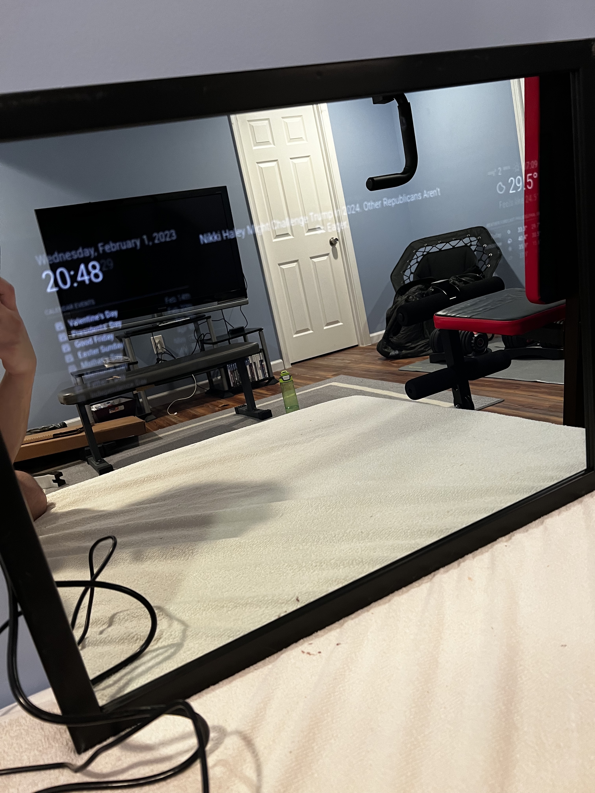
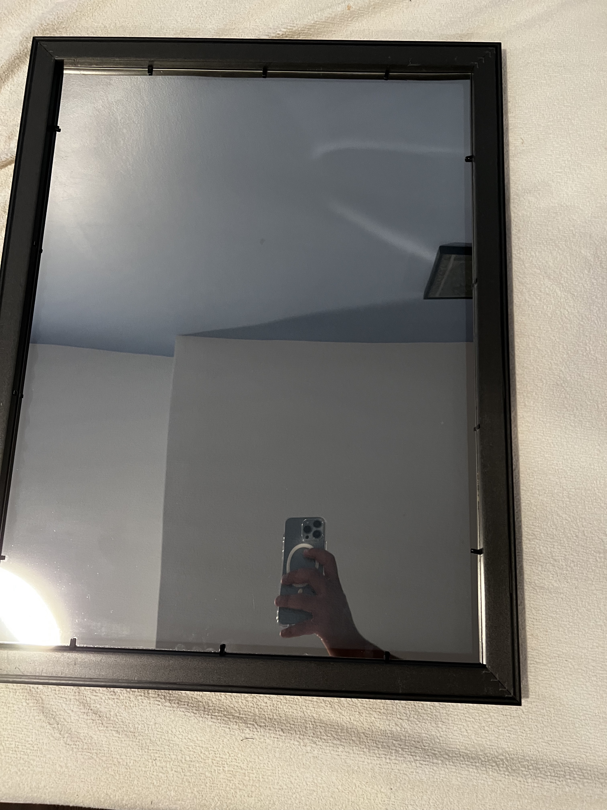
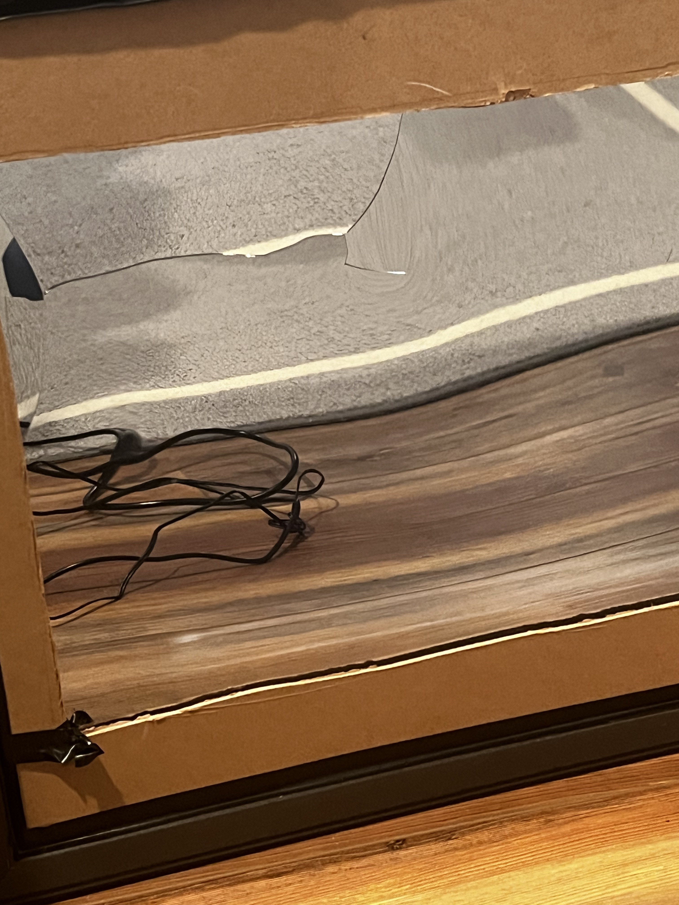
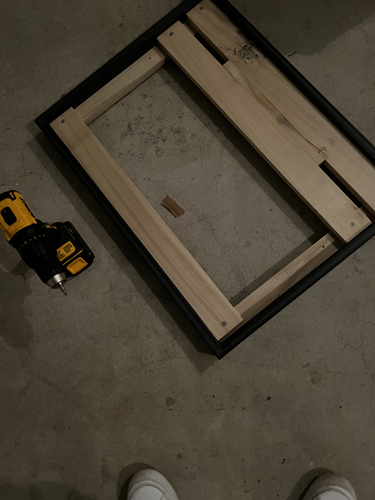
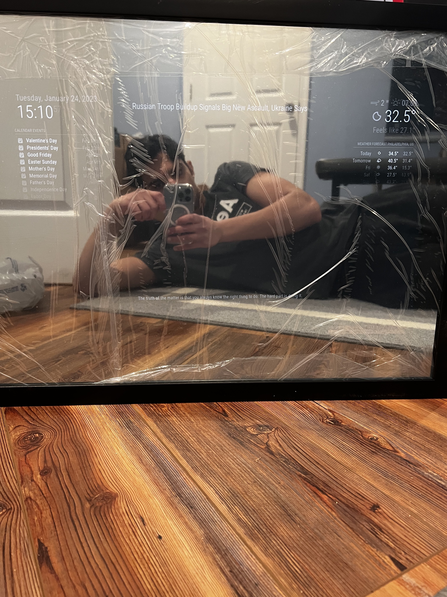

# Smart Mirror

## What is a Smart Mirror?
A Smart Mirror is essentially a two way mirror that can display anything you want on its surface. Some things you can display are the Weather, News, Stocks, Sports team scores. It is HIGHLY customizable and one can create custom modules for it

# Table of contents
- [Attempt 1](#attempt-1)
- [Attempt 2](#attempt-2)
- [Software](#smart-mirror-software)
- [Future](#future-plans)
- [Supplies](#supplies)

# Attempt 1
I took on the challenge of building a Smart Mirror after going online and looking for projects I could utilize my Raspberry Pi 4 for. I saw the Smart Mirror project as a cool use for it. 

The first step I did was, I ordered a Picture Frame, Monitor, and an Acryllic Two Way Mirror. I went with the Acryllic Two Way Mirror because it was the cheaper option opposed to a regular glass mirror

Once the supplies arrived I got to work.

I disassembled the Acer monitor and removed all sorts of framing from it.

I then took the cardboard picture frame backing and cut out a slot for the monitor in the back.

I then hastily used electric tape to sort of hold it all together temporarily so that I could just see how it would work

You probably are concerned with the way I described this project so far... Yeah....

I held the mirror up on a drawer to snap some pictures of it and DROP and CRACK

The mirror was shattered....

## Lessons
Yeah, my first attempt at this project was a complete failure. Looking back, I do not know what I was thinking with this because it was really structurally weak.

However, I really wanted to complete this project so I decided to not cut corners with design and invest the money and time into a better model.

### New Plan
- Buy a bigger frame
- Go to lowes and buy wooden parts to make a stable base
- Buy the more expensive and sturdy mirror

# Attempt 2

Ok, lets try this again. Once I receieved the new parts, I measured the size and dimension of things. I then went to Lowes and bought wooden planks that could fit into the frame and keep the entire structure from moving.

Once I did the long and tedious process of marking nail holes, drilling holes, adjusting the planks to see what would create the most sturdiest design.

Thankfully it looked like this did the trick as the Smart Mirror looks sturdy and works as expected!

# Smart Mirror Software
I am not going to go deep into detail as to how I set up the software but I used the Open Source Magic Mirror Repo(https://docs.magicmirror.builders/) and tinkered a bit with my Raspberry Pi 4 to make it start on boot

# Future Plans
There are a lot of things I can do with this, but here are some ideas
- Voice Activation
- LED Lighting
- Making the Wires Cleaner
- Creating some new modules
- Adding a Camera

# Supplies
Below is everything I bought. As you can tell some things are more expensive than others and I have also listed the equipment from my first failed attempt. I believe you can still set up a sturdy mirror with the tools from the first attempt, although you WILL need to buy some wooden planks and "sturdy" it up
- [Raspberry Pi 4](https://www.canakit.com/raspberry-pi-4-starter-kit.html) ~$100
- [Acryllic Two Way Mirror](https://www.amazon.com/dp/B07XTRCTQL?psc=1&ref=ppx_yo2ov_dt_b_product_details) ~$40
- [Acer Monitor](https://www.amazon.com/dp/B0148NNKTC?psc=1&ref=ppx_yo2ov_dt_b_product_details) ~$100
- [Poster Frame](https://www.amazon.com/dp/B07CHXQTQY?psc=1&ref=ppx_yo2ov_dt_b_product_details) ~$30
- [Two Way Glass Mirror](https://www.amazon.com/dp/B01MSAZ3PN?ref=ppx_yo2ov_dt_b_product_details&th=1) ~$150
- [Thick Picture Frame](https://www.jerrysartarama.com/gotham-black-extra-deep-frame-18x24) ~$30
- Lowes Wooden Planks ~$30
- Screws, Screw Driver, Electric Tape

